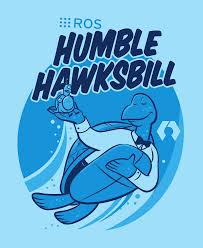

#     ROS-ROBOT OPERATING SYSTEM [🚀](https://img.shields.io/badge/Status-Active-brightgreen?style=flat-square)

 

##                                ROS 2 HUMBLE 

##                                ROS 2 HUMBLE 

ROS Nedir? ROS, "Robot Operating System" (Robot İşletim Sistemi) kısaltmasıdır. Ancak, ROS aslında bir işletim sistemi değil, robot yazılımlarını geliştirmek için kullanılan bir çerçeve (framework) veya bir yazılım platformudur. ROS, robotların donanım ve yazılım bileşenlerini entegre etmek, robot uygulamaları geliştirmek ve robot sistemlerinin yönetimini sağlamak için bir dizi araç ve kütüphane sunar.

ROS'un Kökeni ve Tarihçesi: ROS, ilk olarak 2007 yılında Stanford Üniversitesi'nde, "Stanford Artificial Intelligence Laboratory (SAIL)" tarafından geliştirilmiştir. Bu yazılım, o dönemde robot teknolojilerinde araştırma ve geliştirme süreçlerini kolaylaştırmak için tasarlanmıştı. Daha sonra ROS, 2010 yılında Willow Garage şirketi tarafından daha geniş bir topluluk için geliştirilmeye başlanmış ve açık kaynaklı bir proje olarak yayımlandı. Zamanla, birçok robotik şirketi ve araştırma kuruluşu tarafından benimsendi ve büyük bir ekosistem haline geldi.

ROS Nasıl Çalışır? ROS, bir robotun yazılım bileşenlerinin yönetimini sağlar. Bu bileşenler genellikle "node" (düğüm) adı verilen bağımsız birimlerdir. Bu düğümler, farklı işlevleri yerine getiren yazılım modülleridir. Örneğin, bir robotun sensör verilerini toplamak için bir düğüm, hareket etmek için başka bir düğüm, bir başka düğüm ise robotun yönünü hesaplayabilir.

ROS, bu düğümler arasındaki iletişimi sağlamak için çeşitli yöntemler kullanır:

    Publisher-Subscriber (Yayıncı-Abone): Bir düğüm, verileri yayınlayabilir (publisher), diğer düğümler ise bu verilere abone olabilir (subscriber). Örneğin, bir kamera modülü verileri yayınlarken, bir hareket kontrol modülü bu veriye abone olabilir.
    Service-Client (Servis-Müşteri): Bir düğüm, belirli bir isteği yerine getirecek bir servis sunabilir, diğer düğümler ise bu servisi çağırabilir.
    Action: Daha uzun süren görevler için kullanılan bir başka iletişim mekanizmasıdır.

ROS, robotların farklı donanım ve yazılım bileşenlerinin uyum içinde çalışmasını sağlayan bir "middleware" (ara yazılım) katmanıdır.

ROS'un Temel Özellikleri:

    Açık Kaynak: ROS açık kaynaklıdır, bu nedenle herkes ROS'u kullanabilir, geliştirebilir ve katkı sağlayabilir.
    Modüler Yapı: ROS, robotik yazılımı modüler bir şekilde geliştirmeyi kolaylaştırır. Farklı işlevleri yerine getiren düğümler birbirinden bağımsızdır.
    Hizmetler ve Araçlar: ROS, robot geliştirme sürecini kolaylaştıran birçok araç ve kütüphane içerir. Örneğin, simülasyonlar yapmak için "Gazebo", robotlar arası iletişim için "roscore" gibi araçlar vardır.
    Donanım Desteği: ROS, çok sayıda robot donanımını destekler ve kullanıcıların farklı robot platformlarını kullanarak yazılım geliştirmesini kolaylaştırır.

Sonuç olarak, ROS, robot teknolojileri ve araştırmalarını daha verimli hale getiren güçlü bir yazılım platformudur. Hem akademik hem de endüstriyel alanda geniş bir kullanım alanına sahiptir ve robotların geliştirilmesinde önemli bir rol oynamaktadır.
